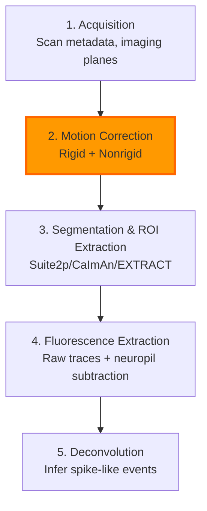

# Modular and Scalable Neural Data Pipelines

From Calcium Imaging to Pose Estimation and Foundation Models

<div class="pt-12">
  <span class="text-6xl">
    Experiment → Data → Pipelines → Analyses → Models
  </span>
</div>

<div class="abs-bottom m-6 text-xl">
  Sidharth Hulyalkar
</div>

<!--
Welcome everyone. I'm Sid Hulyalkar, and today I'm going to walk you through the architecture and inner workings of the Sabatini-DataJoint infrastructure I helped build—a modular, scalable platform for managing complex neuroscience experiments at scale.
-->

---
layout: two-cols
---

# Background: From NEATLABs to DataJoint Pipelines

::left::

## NEATLABs (2017-2022)
- UC San Diego Bioengineering
- Inhibitory control in rodents
- Go/NoGo, PRL, Temporal Discounting
- Dynamic Time Warping on LFP data
- SDSC Supercomputer Center clusters
- Built reusable pipelines (still in production)

::right::

## DataJoint (2022-2024)
- Neuroscience Data Engineer
- End-to-end multimodal pipelines
- Cloud & edge computing infrastructure
- Testing suites: Ca imaging, ephys, pose
- Worker orchestration systems
- Multiple lab collaborations (Harvard, Allen Institute, IU)

<!--
My path into this project starts at UCSD's NEATLABs, where I worked on inhibitory network dynamics and decision-making tasks. When I joined DataJoint as a neuroscience data engineer, I shifted from one-off analyses to building reusable, schema-driven pipelines.
-->

---

# Sabatini-DataJoint Infrastructure: High-Level Overview

<div class="grid grid-cols-2 gap-4 mt-8">

<div class="p-6 border-2 border-cyan-500 rounded-lg bg-cyan-900/20">

## Lab Context
Sabatini Lab (Harvard Neuroscience) - Complex, multimodal research environment requiring robust infrastructure for diverse experiment types

</div>

<div class="p-6 border-2 border-cyan-500 rounded-lg bg-cyan-900/20">

## Data Types Handled
- Calcium imaging
- Electrophysiology
- Pose estimation (DeepLabCut)
- Orofacial tracking (Facemap)
- Fiber photometry
- Behavioral data

</div>

</div>

<div class="mt-8 p-8 border-3 border-cyan-400 rounded-xl bg-slate-800/30 flex justify-center items-center gap-8 text-2xl">
  <div class="px-8 py-4 bg-cyan-500/30 border-2 border-cyan-400 rounded-lg">Experiments & Rigs</div>
  <div class="text-4xl text-cyan-300">→</div>
  <div class="px-8 py-4 bg-cyan-500/30 border-2 border-cyan-400 rounded-lg">DataJoint Schemas</div>
  <div class="text-4xl text-cyan-300">→</div>
  <div class="px-8 py-4 bg-cyan-500/30 border-2 border-cyan-400 rounded-lg">Worker Pipelines</div>
  <div class="text-4xl text-cyan-300">→</div>
  <div class="px-8 py-4 bg-cyan-500/30 border-2 border-cyan-400 rounded-lg">Analysis/ML Ready</div>
</div>

<!--
The Sabatini Lab is a great example of what a modern neuroscience lab looks like: multiple experiment paradigms, multiple modalities, and a constant need to iterate on analysis. The infrastructure has a clean architecture from experiments to analysis-ready outputs.
-->

---

# Why DataJoint?

## Relational Data + Computational Graphs

<div class="grid grid-cols-2 gap-6 mt-6">

<div>

### Core Ideas
- **Relational data model** with explicit primary/foreign keys
- **Tables as nodes** in a computational graph
- **Computed tables** declare dependencies and processing logic
- **Automatic dependency resolution** and recomputation

</div>

<div>

### Key Capabilities
- **Strong data integrity** - enforced relationships
- **Reproducibility** - parameterized processing
- **Seamless scaling** via worker processes
- **Version control** for analysis parameters

</div>

</div>

<div class="mt-8 p-6 border-2 border-orange-500 rounded-lg bg-orange-900/20">

### The Power: Schema IS Your Job Graph
- Call `populate()` and DataJoint figures out missing rows based on upstream tables
- Processing logic runs only where needed - automatic dependency resolution
- Combined with workers, schema becomes both database AND job orchestrator

</div>

<!--
DataJoint combines a relational data model with a notion of a computational graph. Each table is defined with explicit relationships, and computed tables represent processing steps with automatic dependency resolution.
-->

---

# Organizational Structure: Experiments, Modalities, and Elements

<div class="text-center mb-6">

## Core Entities (Center)

</div>

<div class="flex justify-center gap-4 mb-8">
  <div class="px-6 py-3 border-2 border-green-400 rounded-lg bg-green-900/20">Animal</div>
  <div class="px-6 py-3 border-2 border-green-400 rounded-lg bg-green-900/20">Session</div>
  <div class="px-6 py-3 border-2 border-green-400 rounded-lg bg-green-900/20">Equipment</div>
  <div class="px-6 py-3 border-2 border-green-400 rounded-lg bg-green-900/20">Protocol</div>
</div>

<div class="text-center mb-4">

## Modality-Specific Elements (Branches)

</div>

<div class="grid grid-cols-3 gap-4">
  <div class="p-4 border-2 border-blue-400 rounded-lg bg-blue-900/20 text-sm">
    <div class="font-bold">Element-Calcium-Imaging</div>
    <div class="text-xs mt-2">Scan, Processing, Segmentation, Fluorescence</div>
  </div>
  <div class="p-4 border-2 border-blue-400 rounded-lg bg-blue-900/20 text-sm">
    <div class="font-bold">Element-Array-Ephys</div>
    <div class="text-xs mt-2">ProbeInsertion, Recording, Clustering, Units</div>
  </div>
  <div class="p-4 border-2 border-blue-400 rounded-lg bg-blue-900/20 text-sm">
    <div class="font-bold">Element-DeepLabCut</div>
    <div class="text-xs mt-2">VideoRecording, Model, PoseEstimation</div>
  </div>
  <div class="p-4 border-2 border-blue-400 rounded-lg bg-blue-900/20 text-sm">
    <div class="font-bold">Element-Facemap</div>
    <div class="text-xs mt-2">OrofacialTracking, FacialBehavior</div>
  </div>
  <div class="p-4 border-2 border-blue-400 rounded-lg bg-blue-900/20 text-sm">
    <div class="font-bold">Photometry Element</div>
    <div class="text-xs mt-2">FiberPhotometry, Synced Signals</div>
  </div>
  <div class="p-4 border-2 border-blue-400 rounded-lg bg-blue-900/20 text-sm">
    <div class="font-bold">Behavioral Element</div>
    <div class="text-xs mt-2">Trial, Block, BehaviorRecording</div>
  </div>
</div>

<!--
The key design choice was to make modalities specializations of a shared core, rather than separate silos. All experiments hang off the same Session and acquisition tables.
-->

---

# Calcium Imaging Pipeline: From Raw Scans to Activity Traces



```python
# Each step = DataJoint computed table with explicit dependencies

@schema
class MotionCorrection(dj.Computed):
    definition = """
    -> ProcessingTask
    ---
    motion_correction_output: filepath
    """

    def make(self, key):
        # Run Suite2p/CaImAn motion correction
        # Store results, insert into database
        self.insert1(key)
```

<!--
The calcium imaging pipeline is a concrete example of leveraging DataJoint. Each step corresponds to a computed table with explicit dependencies and parameter sets.
-->

---
layout: two-cols
---

# Algorithm Flexibility & Quality Metrics

::left::

## Suite2p
- Image Registration (rigid/non-rigid)
- Cell Detection via correlation
- Fluorescence trace extraction
- Neuropil subtraction
- OASIS deconvolution
- **Fast, widely adopted**

## CaImAn
- NoRMCorre motion correction
- CNMF segmentation
- Denoising & demixing
- Spike inference
- Handles 1P and 2P data
- **Rigorous mathematical framework**

::right::

## EXTRACT
- Local PCA for spatial footprints
- Shape-constrained models
- Spatiotemporal filtering
- Better low SNR detection
- Cleaner separation
- **Novel modeling approach**

<div class="mt-6 p-4 border-2 border-orange-500 rounded-lg bg-orange-900/20">

### Algorithm-Agnostic Design
- Schema doesn't hard-code algorithms
- Algorithm choices via **ProcessingParamSet**
- Enables benchmarking on same scans
- Clean recomputation semantics

</div>

<!--
One of the parts I'm proudest of is how we structured algorithm flexibility. The core schema doesn't hard-code Suite2p versus CaImAn versus EXTRACT, allowing benchmarking without redesigning the data model.
-->

---

# Built-in Quality Metrics for Calcium Imaging

<div class="grid grid-cols-2 gap-6">

<div class="p-6 border-2 border-cyan-500 rounded-lg bg-cyan-900/20">

### Scan-Level Metrics
**Stored in** `scan.ScanQualityMetrics`

- `min_intensity`
- `mean_intensity`
- `max_intensity`
- `contrast` (per frame)

**Use Case:** Automatically flag problematic scans with low contrast or photobleaching

</div>

<div class="p-6 border-2 border-cyan-500 rounded-lg bg-cyan-900/20">

### Mask-Level Metrics
**Stored in** `imaging.ProcessingQualityMetrics.Mask`

- `mask_area` (pixels)
- `mask_roundness`
- `mask_center_x`, `mask_center_y`

**Use Case:** Filter out non-cellular artifacts based on size and shape

</div>

</div>

<div class="grid grid-cols-2 gap-6 mt-6">

<div class="p-6 border-2 border-cyan-500 rounded-lg bg-cyan-900/20">

### Trace-Level Metrics
**Stored in** `imaging.ProcessingQualityMetrics.Trace`

- `temporal_skewness`
- `temporal_variance`
- `signal_to_noise_ratio`

**Use Case:** Identify noisy traces or inactive cells

</div>

<div class="p-6 border-2 border-orange-500 rounded-lg bg-orange-900/20">

### Critical for Scale
At the scale of **hundreds of sessions**, manual QC becomes infeasible.

Automated metrics enable:
- ✓ Batch processing with confidence
- ✓ Reproducible quality thresholds
- ✓ Systematic exclusion criteria
- ✓ Debugging pipeline issues

</div>

</div>

<!--
Without automated QC, manual inspection becomes infeasible. With these metrics built into the schema, we have reproducible quality thresholds and powerful debugging tools.
-->

---

# DataJoint Table Structure: Element-Calcium-Imaging

<div class="grid grid-cols-2 gap-6">

<div>

### Lookup & Manual Tables
- `subject.Subject` - Animal metadata
- `imaging.CellCompartment` - soma, axon, dendrite
- `scan.AcquisitionSoftware` - ScanImage, Prairie, etc.
- `imaging.ProcessingMethod` - Suite2p, CaImAn, EXTRACT
- `session.Session` - Experimental session metadata

</div>

<div>

### Imported Tables
- `scan.Scan` - Scan metadata
- `scan.ScanInfo` - Detailed scan parameters
- `scan.Channel` - Recording channels
- `scan.ScanInfo.Field` - Imaging field info
- `scan.ScanInfo.ScanFile` - File paths

</div>

</div>

### Computed Tables (Processing Pipeline)
<div class="grid grid-cols-2 gap-4 mt-4">

- `imaging.Processing` - Trigger processing
- `imaging.MotionCorrection` - Motion correction results
- `imaging.Segmentation` - ROI masks
- `imaging.Fluorescence` - Raw fluorescence traces

---

- `imaging.Activity` - Deconvolved activity
- `scan.ScanQualityMetrics` - Scan-level QC
- `imaging.ProcessingQualityMetrics` - Mask & trace QC

</div>

<div class="mt-6 p-4 border-2 border-orange-500 rounded-lg bg-orange-900/20">

### Key Insight: Hierarchical Dependencies
DataJoint automatically resolves the dependency chain: Motion correction → Segmentation → Fluorescence → Activity

</div>

<!--
These tables have hierarchical dependencies that DataJoint resolves automatically when you call populate, executing the pipeline in the correct order.
-->

---

# Element-DeepLabCut: Markerless Pose Estimation

<div class="grid grid-cols-2 gap-6">

<div>

### What is DeepLabCut?
- **Markerless pose estimation** using deep neural networks
- Input: Videos of behaving animals
- **ResNet or MobileNet** backbone architectures
- Transfer learning from ImageNet
- Per-frame (x, y) coordinates with confidence scores
- Tracks arbitrary body parts defined by user

</div>

<div>

### Why It Matters
- Replaces manual annotation or physical markers
- Enables quantitative behavior analysis at scale
- Correlate body movements with neural activity
- Critical for closed-loop experiments
- **Fully integrated** into DataJoint workflow

</div>

</div>

### DeepLabCut Workflow in Element

<div class="flex justify-between mt-6 text-sm">
  <div class="flex-1 p-3 border-2 border-cyan-400 rounded-lg bg-cyan-900/20 mx-1 text-center">1. Create Project<br/><span class="text-xs">Label body parts</span></div>
  <div class="flex-1 p-3 border-2 border-cyan-400 rounded-lg bg-cyan-900/20 mx-1 text-center">2. Train Model<br/><span class="text-xs">Run training</span></div>
  <div class="flex-1 p-3 border-2 border-cyan-400 rounded-lg bg-cyan-900/20 mx-1 text-center">3. Evaluate<br/><span class="text-xs">Test on frames</span></div>
  <div class="flex-1 p-3 border-2 border-cyan-400 rounded-lg bg-cyan-900/20 mx-1 text-center">4. Inference<br/><span class="text-xs">Apply to videos</span></div>
</div>

<div class="flex justify-between mt-2 text-sm">
  <div class="flex-1 p-3 border-2 border-cyan-400 rounded-lg bg-cyan-900/20 mx-1 text-center">5. Import Videos<br/><span class="text-xs">Ingest metadata</span></div>
  <div class="flex-1 p-3 border-2 border-cyan-400 rounded-lg bg-cyan-900/20 mx-1 text-center">6. Pose Estimation<br/><span class="text-xs">Pair videos/models</span></div>
  <div class="flex-1 p-3 border-2 border-cyan-400 rounded-lg bg-cyan-900/20 mx-1 text-center">7. Synchronize<br/><span class="text-xs">Align with neural</span></div>
  <div class="flex-1 p-3 border-2 border-cyan-400 rounded-lg bg-cyan-900/20 mx-1 text-center">8. Analyze<br/><span class="text-xs">Visualize & publish</span></div>
</div>

<div class="mt-6 text-center text-cyan-300">
**GitHub:** github.com/datajoint/element-deeplabcut
</div>

<!--
DeepLabCut revolutionized behavioral analysis by enabling markerless pose estimation. The Element-DeepLabCut workflow integrates the entire process into DataJoint.
-->

---

# Element-DeepLabCut: Schema Architecture

### Table Organization

<div class="mb-4">
<div class="font-bold text-yellow-300 mb-2">Lookup Tables</div>
<div class="flex gap-3">
  <div class="px-4 py-2 border-2 border-yellow-400 rounded-lg bg-yellow-900/20">subject.Subject</div>
  <div class="px-4 py-2 border-2 border-yellow-400 rounded-lg bg-yellow-900/20">lab.Device</div>
  <div class="px-4 py-2 border-2 border-yellow-400 rounded-lg bg-yellow-900/20">model.BodyPart</div>
</div>
</div>

<div class="mb-4">
<div class="font-bold text-green-300 mb-2">Manual Tables</div>
<div class="flex gap-3">
  <div class="px-4 py-2 border-2 border-green-400 rounded-lg bg-green-900/20">session.Session</div>
  <div class="px-4 py-2 border-2 border-green-400 rounded-lg bg-green-900/20">train.TrainingParamSet</div>
  <div class="px-4 py-2 border-2 border-green-400 rounded-lg bg-green-900/20">train.VideoSet</div>
</div>
</div>

<div class="mb-4">
<div class="font-bold text-blue-300 mb-2">Imported Tables</div>
<div class="flex gap-3">
  <div class="px-4 py-2 border-2 border-blue-400 rounded-lg bg-blue-900/20">model.VideoRecording</div>
  <div class="px-4 py-2 border-2 border-blue-400 rounded-lg bg-blue-900/20">model.Model</div>
  <div class="px-4 py-2 border-2 border-blue-400 rounded-lg bg-blue-900/20">train.VideoSet.File</div>
</div>
</div>

<div class="mb-4">
<div class="font-bold text-red-300 mb-2">Computed Tables (Processing Pipeline)</div>
<div class="grid grid-cols-3 gap-3">
  <div class="px-4 py-2 border-2 border-red-400 rounded-lg bg-red-900/20">model.RecordingInfo</div>
  <div class="px-4 py-2 border-2 border-red-400 rounded-lg bg-red-900/20">model.PoseEstimationTask</div>
  <div class="px-4 py-2 border-2 border-red-400 rounded-lg bg-red-900/20">model.ModelEvaluation</div>
  <div class="px-4 py-2 border-2 border-red-400 rounded-lg bg-red-900/20">model.PoseEstimation</div>
  <div class="px-4 py-2 border-2 border-red-400 rounded-lg bg-red-900/20">train.TrainingTask</div>
  <div class="px-4 py-2 border-2 border-red-400 rounded-lg bg-red-900/20">train.ModelTraining</div>
</div>
</div>

<!--
The Element-DeepLabCut schema follows the same organizational pattern. Clean separation between training workflow and inference workflow.
-->

---

# Technical Deep Dive: Complex Filepath Handling

### The Challenge: Managing Files Across Environments

DeepLabCut generates nested directory structures with model checkpoints, config files, and output H5/CSV files. Different environments (local, cloud, HPC) have different root paths.

<div class="grid grid-cols-2 gap-6 mt-6">

<div class="p-6 border-2 border-red-500 rounded-lg bg-red-900/20">

#### ❌ Problems Without Abstraction
- Hard-coded absolute paths break across systems
- Can't move data between local/cloud/cluster
- Package requirements expect rigid directory structure
- Manual path management doesn't scale

</div>

<div class="p-6 border-2 border-green-500 rounded-lg bg-green-900/20">

#### ✓ DataJoint Filepath Attributes
- Store **relative paths** in database
- Resolve to absolute at runtime
- Configurable root prefixes per environment
- Symlink strategy for package compatibility

</div>

</div>

```python
# Example: Filepath attribute with prefix handling

@schema
class PoseEstimation(dj.Computed):
    definition = """
    -> VideoRecording
    -> Model
    ---
    pose_estimation_output: filepath@pose_store  # Resolved at runtime
    """

    # Database stores: "session_001/dlc_output/video_labeled.mp4"
    # Local resolves to: "/data/experiments/session_001/dlc_output/video_labeled.mp4"
    # Cloud resolves to: "s3://bucket/experiments/session_001/dlc_output/video_labeled.mp4"
```

<!--
This kind of infrastructure work—filepath abstraction, prefix handling, symlink bridges—makes the difference between a research prototype and a system that runs in production.
-->

---

# Symlink Architecture: Bridging DataJoint and Package Requirements

### Three-Layer Architecture

<div class="space-y-4">

<div class="p-6 border-2 border-orange-400 rounded-lg bg-orange-900/20">

**1. DataJoint Store Layer**

Abstract storage interface with configurable backends:
- Local filesystem with configurable root
- AWS S3 with prefix mapping
- Google Cloud Storage
- Any custom store implementation

</div>

<div class="p-6 border-2 border-cyan-400 rounded-lg bg-cyan-900/20">

**2. Prefix Resolution Layer**

Runtime resolution of relative paths to absolute paths:
- Database: `"session_001/dlc_output/video.mp4"`
- Local: `"/data/experiments/session_001/dlc_output/video.mp4"`
- Cloud: `"s3://bucket/experiments/session_001/dlc_output/video.mp4"`

</div>

<div class="p-6 border-2 border-green-400 rounded-lg bg-green-900/20">

**3. Symlink Bridge Layer**

Create temporary symlinks to satisfy package directory requirements:
1. Fetch files from DataJoint store to temp directory
2. Create symlinks matching expected DLC structure
3. Run inference with symlinked paths
4. Capture outputs and store back to DataJoint
5. Clean up temporary symlinks

</div>

</div>

<!--
This three-layer approach lets the same pipeline code run on local workstations, cloud compute, and HPC clusters without modification. For Dolby, this is directly relevant to managing media assets across distributed systems.
-->

---
layout: two-cols
---

# Element-Facemap: Orofacial Tracking

::left::

### Facemap Capabilities
- **Distinct keypoint detection** on mouse face
- **SVD-based** dimensionality reduction
- **Pupil tracking** for arousal states
- **Deep learning model** training and inference
- Quantify whisking, facial movements, eye dynamics

### My Contributions
- Integrated **deep learning model training** as open-source feature
- Added **inference capabilities** with DataJoint workflow
- Deployed for **Lu Lab at Indiana University**
- Cloud execution alongside DeepLabCut
- Two schema variants: inference-only vs full training

::right::

### Why Orofacial Tracking Matters

Facial movements, whisking, and pupil dilation are rich behavioral signals that correlate strongly with neural activity, arousal states, and task engagement.

Combining pose estimation (body) with orofacial tracking (face) gives a complete picture of animal behavior.

<div class="grid grid-cols-2 gap-4 mt-6">
  <div class="p-4 border-2 border-cyan-400 rounded-lg bg-cyan-900/20">
    <div class="font-bold">facemap_inference Schema</div>
    <div class="text-sm mt-2">For running pre-trained models</div>
  </div>
  <div class="p-4 border-2 border-cyan-400 rounded-lg bg-cyan-900/20">
    <div class="font-bold">facial_behavior_estimation</div>
    <div class="text-sm mt-2">For full training pipeline</div>
  </div>
</div>

<div class="mt-6 text-center text-cyan-300">
**GitHub:** github.com/datajoint/element-facemap
</div>

<!--
Element-Facemap brings orofacial tracking into the DataJoint ecosystem. My contribution was integrating the deep learning training workflow and full inference capabilities.
-->

---

# Lu Lab Cloud Deployment: Pose Estimation + Orofacial Tracking

### AWS Architecture - Lu Lab, Indiana University

<div class="grid grid-cols-2 gap-6">

<div class="p-6 border-2 border-orange-400 rounded-lg bg-orange-900/20">

**🗄️ Database**

**AWS RDS MySQL**
- Managed database service
- Automated backups
- Multi-AZ for high availability

</div>

<div class="p-6 border-2 border-orange-400 rounded-lg bg-orange-900/20">

**💻 Compute**

**AWS EC2 GPU Instances**
- NVIDIA GPUs for DLC & Facemap
- Spot instances for cost optimization
- Auto-scaling worker pools

</div>

<div class="p-6 border-2 border-orange-400 rounded-lg bg-orange-900/20">

**📦 Storage**

**AWS S3**
- Video files & model outputs
- Lifecycle policies for archival
- Versioning enabled

</div>

<div class="p-6 border-2 border-orange-400 rounded-lg bg-orange-900/20">

**🔧 Orchestration**

**DataJoint Worker System**
- Docker containers per modality
- Job queue management
- Atomic transactions

</div>

</div>

### Challenges Solved
- ✓ **GPU resource allocation** across multiple processing pipelines (DLC + Facemap)
- ✓ **Video file streaming** from S3 to GPU workers without exhausting local storage
- ✓ **Synchronization** of pose and orofacial data with neural recordings
- ✓ **Cost optimization** with spot instances and intelligent job scheduling

<!--
The Lu Lab deployment is a concrete example of this infrastructure operating at scale in the cloud. This has been running in production, processing hundreds of videos with consistent quality and reliability.
-->

---

# Worker-Based Orchestration: Sabatini-DataJoint Pipeline

<div class="text-center mb-8">
  <div class="inline-block px-12 py-6 border-3 border-cyan-400 rounded-xl bg-cyan-900/30 text-3xl font-bold">
    DataJoint Worker Orchestrator
  </div>
</div>

<div class="grid grid-cols-4 gap-4">

<div class="p-6 border-2 border-blue-400 rounded-lg bg-blue-900/20 text-center">
  <div class="text-4xl mb-3">🐳</div>
  <div class="font-bold text-cyan-300 mb-2">Standard Worker</div>
  <div class="text-sm">Light tasks<br/>Metadata ingestion<br/>Quality control checks</div>
</div>

<div class="p-6 border-2 border-green-400 rounded-lg bg-green-900/20 text-center">
  <div class="text-4xl mb-3">🧠</div>
  <div class="font-bold text-green-300 mb-2">Ca Imaging Worker</div>
  <div class="text-sm">Suite2p, CaImAn, EXTRACT<br/>GPU-heavy jobs<br/>Deconvolution</div>
</div>

<div class="p-6 border-2 border-red-400 rounded-lg bg-red-900/20 text-center">
  <div class="text-4xl mb-3">⚡</div>
  <div class="font-bold text-red-300 mb-2">Spike Sorting Worker</div>
  <div class="text-sm">Kilosort<br/>CUDA/CPU sort<br/>Ephys alignment</div>
</div>

<div class="p-6 border-2 border-purple-400 rounded-lg bg-purple-900/20 text-center">
  <div class="text-4xl mb-3">🎥</div>
  <div class="font-bold text-purple-300 mb-2">DeepLabCut Worker</div>
  <div class="text-sm">Video-based jobs<br/>Pose Estimation<br/>Facemap tracking</div>
</div>

</div>

<div class="mt-8 text-center px-8 py-4 border-2 border-cyan-400 rounded-xl bg-cyan-900/30 text-xl font-semibold">
  HARVARD CLUSTER (EDGE INFRASTRUCTURE)
</div>

### Architecture Features
- **Modular worker-based architecture** (Dockerized for reproducibility)
- Each worker type dedicated to a specific data modality
- **Edge deployment** on Harvard compute cluster
- Each computation is an **atomic database transaction** (safe, rollback-able)
- Built-in reproducibility and **job traceability** across hundreds of sessions

<!--
The Sabatini-DataJoint pipeline uses modular worker-based orchestration. Each computation is an atomic database transaction—it either completes and commits or fails and rolls back without corrupting the database.
-->

---

# Testing, QA, and Infrastructure Robustness

<div class="grid grid-cols-2 gap-6">

<div>

### Comprehensive Testing Suite
- **Calcium imaging** end-to-end tests
- **Electrophysiology** pipeline validation
- **Pose estimation** (DeepLabCut) tests
- **Orofacial tracking** (Facemap) tests
- Simulated datasets + small real datasets
- CI-style checks for schema & pipeline integrity

</div>

<div>

### Benefits
- **Confident refactoring** and new features
- **Easy onboarding** for new labs or projects
- **Catch breaking changes** before production
- **Validate algorithm swaps** (Suite2p ↔ CaImAn)
- Inheritance of **tested, well-structured** pipelines
- Not just research code—**production-grade**

</div>

</div>

### End-to-End Test Workflow

<div class="flex justify-center items-center gap-8 mt-8">
  <div class="flex-1 p-6 border-2 border-cyan-400 rounded-lg bg-cyan-900/20 text-center">
    <div class="font-bold text-cyan-300 mb-2">1. Test Data</div>
    <div class="text-sm">Simulated or small real datasets</div>
  </div>
  <div class="text-4xl text-cyan-300">→</div>
  <div class="flex-1 p-6 border-2 border-cyan-400 rounded-lg bg-cyan-900/20 text-center">
    <div class="font-bold text-cyan-300 mb-2">2. Run Pipeline</div>
    <div class="text-sm">Ingestion → Processing → QC</div>
  </div>
  <div class="text-4xl text-cyan-300">→</div>
  <div class="flex-1 p-6 border-2 border-cyan-400 rounded-lg bg-cyan-900/20 text-center">
    <div class="font-bold text-cyan-300 mb-2">3. Validate</div>
    <div class="text-sm">Metrics & pass/fail checks</div>
  </div>
</div>

<div class="mt-6 p-6 border-2 border-green-500 rounded-lg bg-green-900/20 text-center">
  <div class="font-bold text-green-300 text-xl">Result: Verified end-to-end functionality</div>
</div>

<!--
A big part of making this infrastructure sustainable was treating it like a real software system and investing in testing. Without tests, every schema change is risky. With tests, we have continuous improvement.
-->

---

# End-to-End Data Pipeline Architecture

<div class="text-xs leading-tight">

<div class="grid grid-cols-6 gap-2">

<div class="p-3 border-2 border-cyan-400 rounded-lg bg-cyan-900/20">
<div class="font-bold text-cyan-300 mb-2 text-center">Data Sources</div>
<div class="space-y-2">
  <div class="flex items-center gap-2">
    <span class="text-orange-400">🎥</span>
    <div>
      <div class="font-semibold">Raw Videos</div>
      <div class="text-xs opacity-70">~2-50 GB each</div>
    </div>
  </div>
  <div class="flex items-center gap-2">
    <span class="text-green-400">📚</span>
    <div>
      <div class="font-semibold">TIFF Stacks</div>
      <div class="text-xs opacity-70">~5-100 GB each</div>
    </div>
  </div>
  <div class="flex items-center gap-2">
    <span class="text-purple-400">📄</span>
    <div>
      <div class="font-semibold">Behavior Logs</div>
      <div class="text-xs opacity-70">.csv, .mat</div>
    </div>
  </div>
  <div class="flex items-center gap-2">
    <span class="text-yellow-400">⚙️</span>
    <div>
      <div class="font-semibold">Metadata</div>
      <div class="text-xs opacity-70">.yaml, .json</div>
    </div>
  </div>
</div>
</div>

<div class="flex items-center justify-center text-4xl text-cyan-300">→</div>

<div class="p-3 border-2 border-blue-400 rounded-lg bg-blue-900/20">
<div class="font-bold text-blue-300 mb-2 text-center">Ingestion & Storage</div>
<div class="space-y-2">
  <div class="p-2 border border-blue-400 rounded bg-blue-900/30 text-center">
    <div class="font-semibold">🗄️ MySQL / AWS RDS</div>
    <div class="text-xs opacity-70">DataJoint Schemas</div>
  </div>
  <div class="p-2 border border-orange-400 rounded bg-orange-900/30 text-center">
    <div class="font-semibold">☁️ AWS S3</div>
    <div class="text-xs opacity-70">Raw & Processed Data</div>
  </div>
</div>
</div>

<div class="flex items-center justify-center text-4xl text-cyan-300">→</div>

<div class="p-3 border-3 border-green-400 rounded-lg bg-green-900/30">
<div class="font-bold text-green-300 mb-2 text-center">Automated Processing ⚡</div>

<div class="px-4 py-2 border-2 border-cyan-400 rounded bg-cyan-900/40 text-center mb-2">
  <div class="font-semibold">DataJoint Worker Orchestrator</div>
</div>

<div class="grid grid-cols-2 gap-1 text-xs">
  <div class="p-2 border border-blue-400 rounded bg-blue-900/30 text-center">
    <div>⚙️ Standard</div>
    <div class="text-xs opacity-70">Metadata & QC</div>
  </div>
  <div class="p-2 border-3 border-green-400 rounded bg-green-900/40 text-center">
    <div>🧠 GPU</div>
    <div class="text-xs opacity-70">Ca²⁺ & DLC</div>
  </div>
  <div class="p-2 border border-red-400 rounded bg-red-900/30 text-center">
    <div>⚡ Spike Sort</div>
    <div class="text-xs opacity-70">Kilosort</div>
  </div>
  <div class="p-2 border border-purple-400 rounded bg-purple-900/30 text-center">
    <div>👁️ Facemap</div>
    <div class="text-xs opacity-70">Orofacial</div>
  </div>
</div>

<div class="mt-2 p-2 border-l-4 border-yellow-400 bg-yellow-900/20 text-xs">
  ⚡ Table-level triggers auto-deploy jobs
</div>
</div>

<div class="flex items-center justify-center text-4xl text-cyan-300">→</div>

<div class="p-3 border-2 border-blue-400 rounded-lg bg-blue-900/20">
<div class="font-bold text-blue-300 mb-2 text-center">Analysis Results</div>
<div class="space-y-2">
  <div class="p-2 border border-blue-400 rounded bg-blue-900/30">
    <div class="font-semibold">🗄️ Processed Tables</div>
    <ul class="text-xs mt-1 space-y-1 pl-3">
      <li>• Motion Corrected</li>
      <li>• Segmented ROIs</li>
      <li>• Fluorescence Traces</li>
      <li>• Pose Coordinates</li>
    </ul>
  </div>
  <div class="p-2 border border-orange-400 rounded bg-orange-900/30 text-center">
    <div class="font-semibold">☁️ Large Outputs</div>
    <div class="text-xs opacity-70">Corrected videos, models</div>
  </div>
</div>
</div>

<div class="flex items-center justify-center text-4xl text-cyan-300">→</div>

<div class="p-3 border-2 border-cyan-400 rounded-lg bg-cyan-900/20">
<div class="font-bold text-cyan-300 mb-2 text-center">Data Access</div>
<div class="space-y-2">
  <div class="p-2 border border-cyan-400 rounded bg-cyan-900/30 text-center">
    <span class="text-xl">🌐</span>
    <div class="font-semibold">EC2 Web Apps</div>
    <div class="text-xs opacity-70">DataJoint LabBook</div>
  </div>
  <div class="p-2 border border-orange-400 rounded bg-orange-900/30 text-center">
    <span class="text-xl">📓</span>
    <div class="font-semibold">Jupyter Notebooks</div>
    <div class="text-xs opacity-70">Interactive queries</div>
  </div>
  <div class="p-2 border border-green-400 rounded bg-green-900/30">
    <div class="text-center"><span class="text-xl">💻</span> <span class="font-semibold">pip install</span></div>
    <div class="mt-1 p-1 bg-black/50 rounded text-xs font-mono">
      <div class="text-green-400">pip install sabatini-datajoint</div>
      <div class="text-blue-300">import datajoint as dj</div>
      <div class="text-blue-300">from sabatini_pipeline import imaging</div>
    </div>
  </div>
</div>
</div>

</div>

</div>

<!--
This diagram shows the complete data lifecycle. The key innovation is our automated worker system: as soon as data lands in certain tables, table-level triggers automatically deploy the appropriate processing jobs. Notice the GPU worker highlighted—that's where compute-intensive tasks run.
-->

---

# Calcium Imaging: Data to Deconvolved Activity

<div class="flex justify-center items-center gap-4 text-sm">

<div class="flex-1 max-w-[140px] p-4 border-2 border-yellow-400 rounded-lg bg-yellow-900/20 text-center">
  <div class="text-2xl mb-2">🔬</div>
  <div class="font-bold">Raw TIFF</div>
  <div class="text-xs opacity-70">ScanImage / Prairie</div>
</div>

<div class="text-3xl text-cyan-300">→</div>

<div class="flex-1 max-w-[140px] p-4 border-2 border-blue-400 rounded-lg bg-blue-900/20 text-center">
  <div class="text-2xl mb-2">↔️</div>
  <div class="font-bold">Motion Correction</div>
  <div class="text-xs opacity-70">Rigid / Non-rigid</div>
  <div class="mt-1 px-2 py-1 bg-blue-900/40 rounded text-xs">Suite2p / CaImAn</div>
</div>

<div class="text-3xl text-cyan-300">→</div>

<div class="flex-1 max-w-[140px] p-4 border-2 border-green-400 rounded-lg bg-green-900/20 text-center">
  <div class="text-2xl mb-2">🔲</div>
  <div class="font-bold">ROI Detection</div>
  <div class="text-xs opacity-70">Cell Masks</div>
  <div class="mt-1 px-2 py-1 bg-green-900/40 rounded text-xs">Suite2p / CaImAn / EXTRACT</div>
</div>

<div class="text-3xl text-cyan-300">→</div>

<div class="flex-1 max-w-[140px] p-4 border-2 border-purple-400 rounded-lg bg-purple-900/20 text-center">
  <div class="text-2xl mb-2">📈</div>
  <div class="font-bold">Fluorescence</div>
  <div class="text-xs opacity-70">ΔF/F₀ Traces</div>
</div>

<div class="text-3xl text-cyan-300">→</div>

<div class="flex-1 max-w-[150px] p-4 border-3 border-red-400 rounded-lg bg-red-900/30 text-center">
  <div class="text-2xl mb-2">⚡</div>
  <div class="font-bold">Inferred Spikes</div>
  <div class="text-xs opacity-70">OASIS Algorithm</div>
</div>

</div>

<div class="mt-8 flex justify-center">

<div class="flex items-start gap-4">
<div class="text-4xl text-cyan-300">↓</div>
<div class="p-6 border-2 border-orange-400 rounded-lg bg-orange-900/20 max-w-md">
<div class="font-bold text-orange-300 mb-2">Quality Metrics Branch</div>
<div class="text-sm">
SNR, Mask Area, Roundness, Temporal Variance
</div>
<div class="text-xs opacity-70 mt-2">Validates outputs at each stage</div>
</div>
</div>

</div>

<!--
This shows the calcium imaging processing pipeline in detail. Raw TIFF files from the microscope go through motion correction, ROI detection, fluorescence extraction, and finally deconvolution to infer spike-like neural events. The quality metrics branch validates outputs at each stage.
-->

---

# Multi-Modal Integration via Session Key

<div class="flex justify-center items-center">

<div class="relative w-[600px] h-[600px]">

<!-- Center hub -->
<div class="absolute top-1/2 left-1/2 transform -translate-x-1/2 -translate-y-1/2 w-40 h-40 border-4 border-cyan-400 rounded-full bg-cyan-900/40 flex flex-col items-center justify-center shadow-[0_0_30px_rgba(0,212,255,0.5)]">
  <div class="font-mono text-cyan-300 font-bold">session.Session</div>
  <div class="text-sm text-gray-400">Primary Key</div>
</div>

<!-- Spokes -->
<div class="absolute top-[10%] left-1/2 transform -translate-x-1/2 -translate-y-1/2 px-4 py-3 border-2 border-green-400 rounded-lg bg-green-900/30 text-center text-sm">
  <div class="text-xl mb-1">🧠</div>
  <div class="font-mono text-green-300 font-bold">imaging.Scan</div>
  <div class="text-xs opacity-70">Ca²⁺ Imaging</div>
</div>

<div class="absolute top-[25%] right-[15%] px-4 py-3 border-2 border-red-400 rounded-lg bg-red-900/30 text-center text-sm">
  <div class="text-xl mb-1">⚡</div>
  <div class="font-mono text-red-300 font-bold">ephys.ProbeInsertion</div>
  <div class="text-xs opacity-70">Neuropixels</div>
</div>

<div class="absolute top-1/2 right-[8%] transform -translate-y-1/2 px-4 py-3 border-2 border-orange-400 rounded-lg bg-orange-900/30 text-center text-sm">
  <div class="text-xl mb-1">🎥</div>
  <div class="font-mono text-orange-300 font-bold">model.VideoRecording</div>
  <div class="text-xs opacity-70">DeepLabCut</div>
</div>

<div class="absolute bottom-[25%] right-[15%] px-4 py-3 border-2 border-purple-400 rounded-lg bg-purple-900/30 text-center text-sm">
  <div class="text-xl mb-1">👁️</div>
  <div class="font-mono text-purple-300 font-bold">facemap.FacialSignal</div>
  <div class="text-xs opacity-70">Facemap</div>
</div>

<div class="absolute bottom-[10%] left-1/2 transform -translate-x-1/2 translate-y-1/2 px-4 py-3 border-2 border-cyan-400 rounded-lg bg-cyan-900/30 text-center text-sm">
  <div class="text-xl mb-1">💡</div>
  <div class="font-mono text-cyan-300 font-bold">photometry.FiberPhotometry</div>
  <div class="text-xs opacity-70">Fiber Photometry</div>
</div>

<div class="absolute bottom-[25%] left-[15%] px-4 py-3 border-2 border-yellow-400 rounded-lg bg-yellow-900/30 text-center text-sm">
  <div class="text-xl mb-1">📋</div>
  <div class="font-mono text-yellow-300 font-bold">behavior.Trial</div>
  <div class="text-xs opacity-70">Task Events</div>
</div>

</div>

</div>

<div class="mt-8 p-6 border-2 border-orange-500 rounded-lg bg-orange-900/20 text-center">
  <div class="text-orange-300 text-lg">All modalities share the same Session key → seamless cross-modal analysis with a single JOIN</div>
</div>

<!--
This diagram illustrates the power of DataJoint's relational model. Every data modality connects to the same Session entity. This means you can join any combination of modalities with a single query, enabling true multi-modal analysis without complex data wrangling.
-->

---

# Relevance to Dolby: Transferable Skills

<div class="text-sm space-y-3">

<div class="grid grid-cols-2 gap-4 p-4 border-2 border-cyan-400 rounded-lg bg-cyan-900/20">
  <div>
    <div class="font-bold text-cyan-300 mb-1">🎵 Multimodal Neural Data Pipelines</div>
    <div class="text-xs opacity-80">Calcium imaging, ephys, pose, orofacial tracking with tight synchronization</div>
  </div>
  <div>
    <div class="font-bold text-orange-300 mb-1">→ Audio/Video/Spatial Audio Synchronized Processing</div>
    <div class="text-xs opacity-80">Managing multiple audio streams (Atmos), video sync, spatial audio pipelines</div>
  </div>
</div>

<div class="grid grid-cols-2 gap-4 p-4 border-2 border-cyan-400 rounded-lg bg-cyan-900/20">
  <div>
    <div class="font-bold text-cyan-300 mb-1">📊 Signal Processing (Deconvolution, NMF, Filtering)</div>
    <div class="text-xs opacity-80">Neuropil subtraction, motion correction, spike deconvolution, temporal filtering</div>
  </div>
  <div>
    <div class="font-bold text-orange-300 mb-1">→ Audio Source Separation, Noise Reduction, Codec Development</div>
    <div class="text-xs opacity-80">NMF for source separation, deconvolution for echo cancellation, adaptive filtering</div>
  </div>
</div>

<div class="grid grid-cols-2 gap-4 p-4 border-2 border-cyan-400 rounded-lg bg-cyan-900/20">
  <div>
    <div class="font-bold text-cyan-300 mb-1">☁️ Scalable Cloud/Edge Computing Infrastructure</div>
    <div class="text-xs opacity-80">AWS (RDS, EC2, S3), Harvard clusters, worker orchestration, GPU management</div>
  </div>
  <div>
    <div class="font-bold text-orange-300 mb-1">→ Distributed Transcoding, Real-time Streaming Processing</div>
    <div class="text-xs opacity-80">Distributed job orchestration, GPU allocation, cloud/edge hybrid deployments</div>
  </div>
</div>

<div class="grid grid-cols-2 gap-4 p-4 border-2 border-cyan-400 rounded-lg bg-cyan-900/20">
  <div>
    <div class="font-bold text-cyan-300 mb-1">🤖 Deep Learning for Pose Estimation and Tracking</div>
    <div class="text-xs opacity-80">DeepLabCut and Facemap: training, inference, model evaluation, filepath handling</div>
  </div>
  <div>
    <div class="font-bold text-orange-300 mb-1">→ Computer Vision for Spatial Audio, Object Tracking for Atmos</div>
    <div class="text-xs opacity-80">CNNs for object detection/tracking, scene analysis for immersive experiences</div>
  </div>
</div>

<div class="grid grid-cols-2 gap-4 p-4 border-2 border-cyan-400 rounded-lg bg-cyan-900/20">
  <div>
    <div class="font-bold text-cyan-300 mb-1">🧠 Foundation Models and Transfer Learning</div>
    <div class="text-xs opacity-80">Tokenization, population pooling, Transformer/SSM architectures, contrastive learning</div>
  </div>
  <div>
    <div class="font-bold text-orange-300 mb-1">→ Pre-trained Audio Models, Universal Codec Development</div>
    <div class="text-xs opacity-80">Foundation models (Whisper, AudioLM, MusicGen) revolutionizing audio domain</div>
  </div>
</div>

<div class="grid grid-cols-2 gap-4 p-4 border-2 border-cyan-400 rounded-lg bg-cyan-900/20">
  <div>
    <div class="font-bold text-cyan-300 mb-1">✅ Reproducible Research Infrastructure</div>
    <div class="text-xs opacity-80">Schema-driven pipelines, provenance tracking, parameter versioning, comprehensive testing</div>
  </div>
  <div>
    <div class="font-bold text-orange-300 mb-1">→ Quality Assurance, A/B Testing Infrastructure</div>
    <div class="text-xs opacity-80">Reproducibility and systematic testing for production ML/signal processing systems</div>
  </div>
</div>

</div>

<!--
These are not superficial analogies; these are deep technical parallels where the same skills, tools, and mindset apply across domains. From multimodal synchronization to signal processing to cloud infrastructure to deep learning and reproducibility.
-->

---

# Key Takeaways

<div class="grid grid-cols-2 gap-6">

<div class="p-6 border-2 border-cyan-400 rounded-lg bg-cyan-900/20">
<div class="text-2xl font-bold text-cyan-300 mb-4">1. Modularity Enables Scale</div>
<div class="text-sm leading-relaxed">
DataJoint Elements demonstrate how **modular, composable components** enable building complex pipelines that scale across institutions and use cases. Clean abstractions and reusable patterns are the foundation of sustainable infrastructure.
</div>
</div>

<div class="p-6 border-2 border-cyan-400 rounded-lg bg-cyan-900/20">
<div class="text-2xl font-bold text-cyan-300 mb-4">2. Reproducibility is Infrastructure</div>
<div class="text-sm leading-relaxed">
Treating reproducibility as a **first-class infrastructure concern** (not an afterthought) pays dividends in debugging, collaboration, and scientific validity. Built-in provenance, parameter versioning, and comprehensive testing are non-negotiable.
</div>
</div>

<div class="p-6 border-2 border-cyan-400 rounded-lg bg-cyan-900/20">
<div class="text-2xl font-bold text-cyan-300 mb-4">3. Foundation Models are Transformative</div>
<div class="text-sm leading-relaxed">
**Pre-training on diverse data** enables transfer learning that reduces labeling requirements and improves generalization across domains. This is revolutionizing NLP, computer vision, and now audio/speech and neuroscience.
</div>
</div>

<div class="p-6 border-2 border-cyan-400 rounded-lg bg-cyan-900/20">
<div class="text-2xl font-bold text-cyan-300 mb-4">4. Interpretability Builds Trust</div>
<div class="text-sm leading-relaxed">
Understanding **why models make decisions** is essential for deployment in high-stakes applications where quality and reliability matter. Mechanistic interpretability provides tools to open the "black box" and debug production systems.
</div>
</div>

</div>

<div class="mt-8 p-6 border-2 border-orange-500 rounded-lg bg-orange-900/20 text-center">
<div class="text-xl font-bold text-orange-300 mb-3">The Through-Line</div>
<div class="text-lg text-orange-200">
**Infrastructure → Foundation Models → Interpretability**
</div>
<div class="mt-3 text-sm">
This combination is the throughline of my work: robust data infrastructure enables training rich foundation models, which require interpretability tools to understand and debug. All three layers are essential for production-grade AI systems.
</div>
</div>

<!--
These four themes capture the essence of the work: modularity enables scale, reproducibility is infrastructure, foundation models are transformative, and interpretability builds trust. The through-line is that all three layers work together.
-->

---
layout: center
class: text-center
---

# Thank You!

## Questions?

<div class="mt-12 p-8 border-2 border-cyan-400 rounded-xl bg-cyan-900/20 inline-block">

<div class="text-lg mb-6">
Today I focused on the **Sabatini-DataJoint infrastructure** as a concrete example of designing and operating a modular, scalable platform for complex neuroscience experiments.
</div>

<div class="flex flex-col gap-4 text-left">
  <div class="flex items-center gap-3">
    <span class="text-2xl">🐙</span>
    <span>GitHub: <a href="https://github.com/sidhulyalkar" class="text-cyan-300 hover:text-cyan-100">github.com/sidhulyalkar</a></span>
  </div>
  <div class="flex items-center gap-3">
    <span class="text-2xl">🧠</span>
    <span>neurOS Project: <a href="https://github.com/sidhulyalkar/neurOS-v1" class="text-cyan-300 hover:text-cyan-100">github.com/sidhulyalkar/neurOS-v1</a></span>
  </div>
  <div class="flex items-center gap-3">
    <span class="text-2xl">📧</span>
    <span>Contact: <span class="text-cyan-300">sidhulyalkar@gmail.com</span></span>
  </div>
</div>

</div>

<!--
I'm happy to go deeper into any aspect: table-level design, orchestration details, filepath handling, foundation model architectures, or how we think about building models on top of these datasets. Thank you for your time and attention.
-->
